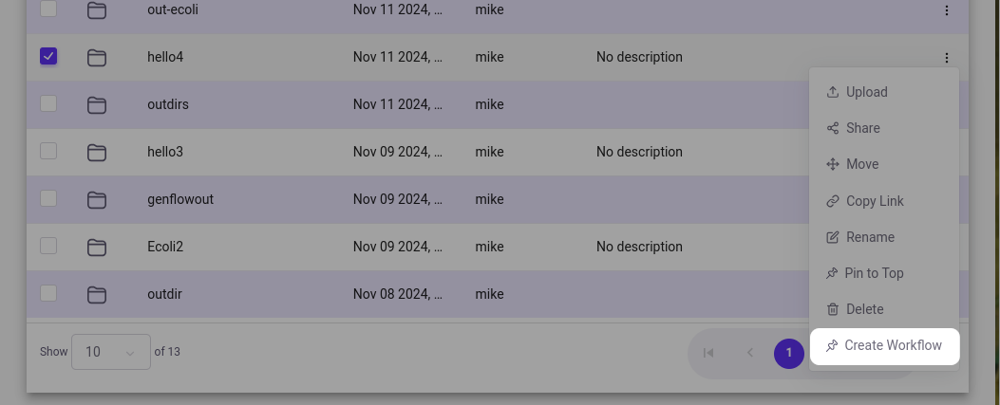
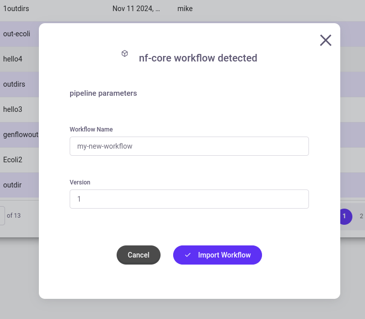
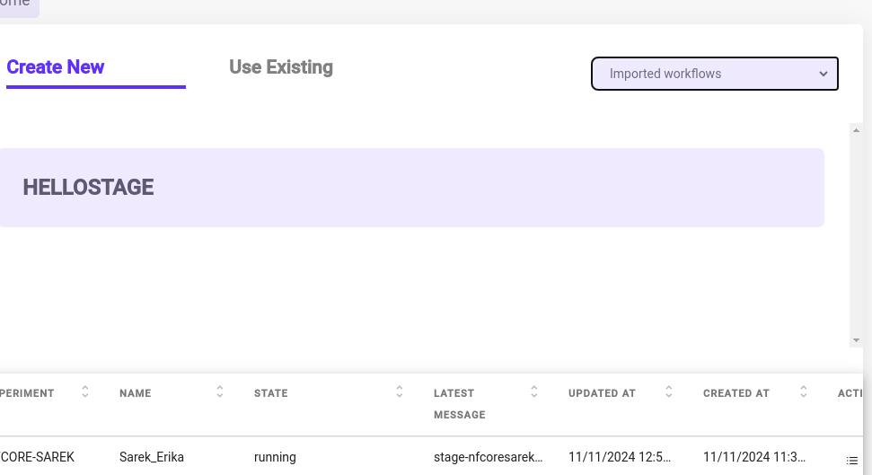

# Nextflow Template for the genRAITplatform

This template provides a basic starting point for working with
[Nextflow](https://www.nextflow.io/) and [nf-core](https://nf-co.re/) on
the [GenRAIT](https://genrait.com/) platform. It is based on
[nf-core/demo](https://github.com/nf-core/demo).

## What is Nextflow?

Nextflow is a workflow management system that enables scalable and
reproducible scientific workflows. It allows you to write complex
pipeline processes using a simple scripting language while handling
parallel execution across compute environments. With Nextflow, you can
easily combine scripts written in different languages (Python, R, Bash,
etc.), automatically handle errors, and resume pipelines from the last
successful step. Through the nf-core ecosystem, you also get access to a
rich collection of pre-built modules and pipelines that can accelerate
your workflow development.

From the Nextflow documentation:

> The Nextflow language is inspired by the [Unix
> philosophy](https://en.wikipedia.org/wiki/Unix_philosophy), in which
> many simple command line tools can be chained together into
> increasingly complex tasks. Similarly, a Nextflow script consists of
> composing many simple processes into increasingly complex pipelines.
> Each process executes a given tool or scripting language, and by
> specifying the process inputs and outputs, Nextflow coordinates the
> execution of tasks for you.

### Processes

Here\'s a simple example of a Nextflow
[process](https://www.nextflow.io/docs/latest/process.html):

``` groovy
process EXAMPLE {
    input:
    path input_file

    output:
    path "output.txt"

    script:
    """
    cat ${input_file} > output.txt
    echo "Process complete" >> output.txt
    """
}
```

This shows the basic structure of a Nextflow process: it defines its
inputs (a file path), outputs (a new file), and the script to execute.
Nextflow handles all the file management, execution tracking, and
parallelization behind the scenes. When combined into workflows, these
processes become powerful data processing pipelines that can handle
complex bioinformatics tasks.

Here is a more complicated example:

``` groovy
process FASTQ_TRIM {
    conda "fastq=1.1.1"

    input:
    tuple val(sample_id), path(reads)

    output:
    tuple val(sample_id), path("*_trimmed.fastq.gz"), emit: trimmed_reads
    path "*.log", emit: logs

    script:
    """
    trim_galore --paired \
        --quality 20 \
        --output_dir . \
        --basename ${sample_id} \
        ${reads[0]} ${reads[1]}
    """
}
```

### Workflows

Here is an example Nextflow
[workflow](https://www.nextflow.io/docs/latest/workflow.html):

``` groovy
workflow {
    Channel
        .fromPath('data/*.fastq.gz')
        .map { file ->
            def sample = file.name.replaceAll(/_R[12].fastq.gz$/, '')
            return tuple(sample, file)
        }
        .groupTuple()
        .set { read_pairs_ch }

    FASTQ_TRIM(read_pairs_ch)
    ALIGNMENT(FASTQ_TRIM.out.trimmed_reads)
    VARIANT_CALL(ALIGNMENT.out.bam)
}
```

This workflow shows how channels and processes work together: it creates
a channel from FASTQ files, processes them to extract sample IDs, groups
related files together, then pipes the data through a series of
processes (FASTQ~TRIM~, ALIGNMENT, and VARIANT~CALL~) to perform a
typical genomics analysis pipeline. Each process builds on the output of
the previous one, creating a complete data processing workflow.

### Channels

Workflows orchestrate processes, but
[channels](https://www.nextflow.io/docs/latest/channel.html) are how
Nextflow deals with data:

``` groovy
// Create a channel from files
reads_ch = Channel.fromPath('data/*.fastq.gz')

// Transform data in a channel
filtered_ch = reads_ch
    .map { file ->
        def sample = file.name.replaceAll(/.fastq.gz$/, '')
        return tuple(sample, file)
    }
    .filter { id, file ->
        file.size() > 1000
    }

// Combine multiple channels
results_ch = Channel.from(1,2,3)
    .combine(Channel.from('A','B'))
```

Channels are Nextflow\'s way of handling data flow between processes.
They can transform, filter, and combine data streams, making it easy to
handle complex data processing patterns.

## Usage

> \[!NOTE\] If you are new to Nextflow and nf-core, please refer to
> [this page](https://nf-co.re/docs/usage/installation) on how to set-up
> Nextflow. Make sure to [test your
> setup](https://nf-co.re/docs/usage/introduction#how-to-run-a-pipeline)
> with `-profile test` before running the workflow on actual
> data.

### Requirements

In order to install modules and update a workflows parameters the user
needs:

-   [nf-core/tools](https://nf-co.re/docs/nf-core-tools/installation)
-   [Nextflow](https://www.nextflow.io/)

### Using nf-core modules

We recommend using the nf-core ecosystem where possible, especially
using nf-core [modules](https://nf-co.re/modules).

List available modules:

``` {.bash org-language="sh"}
nf-core modules list remote
```

Install a module:

``` {.bash org-language="sh"}
nf-core modules install zip
```

Modules will be placed in the `modules` directory, and can be
imported like any other Nextflow module:

``` groovy
include { FASTQC } from '../modules/nf-core/fastqc/main'

workflow EXAMPLE_WORKFLOW {

    take:
    ch_samplesheet 
    main:

    ch_versions = Channel.empty()
    ch_multiqc_files = Channel.empty()
    //
    // MODULE: Run FastQC
    //
    FASTQC (
        ch_samplesheet
    )
    FASTQC.out.view()
}
```

### Writing processes

The user can refer to the Nextflow
[documentation](https://www.nextflow.io/docs/latest/process.html) on
writing processes. In order for the genRAIT platform to resolve software
dependencies, the user needs to declare per-process or global
dependencies with the [conda
directive](https://www.nextflow.io/docs/latest/reference/process.html#conda).

``` groovy
process bwaIndex {
    conda "bwa=0.7.15" // <---

    input:
    path reference

    output:
    tuple val(reference.name), path("${reference}.amb"), path("${reference}.ann"), path("${reference}.bwt"), path("${reference}.sa"), path("${reference}.pac")

    """
    bwa index $reference
    """
}
```

### Parameters

In order for the genRAIT platform to import a workflow, there must be a
`nextflow_schema.json` in the root directory. Pipeline
[parameters](https://www.nextflow.io/docs/latest/config.html#parameters)
must be declared in `nextflow.config` (see
[here](https://www.nextflow.io/docs/latest/workflow.html#using-parameters)
for more information on how to use parameters in your pipeline).

When new parameters are added, use the nf-core schema builder to rebuild
the file:

``` {.bash org-language="sh"}
nf-core pipelines schema build
```

> \[!NOTE\] Parameters which represent files or folders during runtime
> must be declared as such, either through the interactive schema
> builder, or manually in the `nextflow_schema.json`.
>
> 
>
> Here is a parameter marked as a folder in the schema file:
>
> ``` json
> ...
>   "properties": {
>     "outputDir": {
>       "type": "string",
>       "default": "./",
>       "fa_icon": "fas fa-folder",
>       "format": "directory-path",
>       "hidden": false
>     }
>   }
> ...
> ```

### Importing your workflow on genRAIT

Import your folder to your genRAIT storage and select \"Create
Workflow\" from the dropdown.



If there is a `nextflow_schema.json` file in the folder, the
GenRAIT system should detect it and allow you to import your workflow:



Give it a name, and if you want to overwrite one of your older
workflows, you can give it the same name and increment your version.
GenRAIT will always use the latest version of a workflow that it has
available.

Now, you should be able to see your workflow in the Analytics Hub. Make
sure you select \"Imported Workflows\" from the dropdown.


